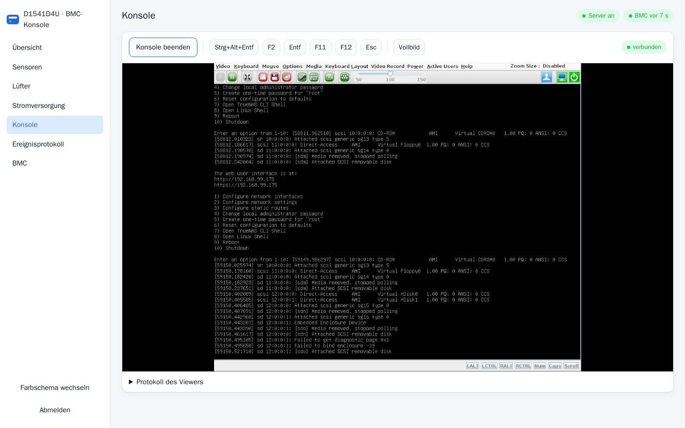

# ASRock Rack D1541D4U-2T8R mit NVIDIA Tesla T4: Unterlagen zum Verkauf

Ein Speicher- und Inferenzserver auf Basis eines Xeon-D-Boards, eingerichtet
unter TrueNAS SCALE. Alle Angaben hier wurden vom 03. bis 05.10.2026 auf dem
laufenden Gerät ausgelesen oder gemessen, nicht aus Datenblättern übernommen.

| Datei | Inhalt |
|---|---|
| [README.md](README.md) | Diese Übersicht: Ausstattung, Zustand, Kühlung, was man wissen sollte |
| [EINRICHTUNG.md](EINRICHTUNG.md) | Was für die T4 eingerichtet ist, Wiederherstellung nach einer Neuinstallation, Fehlersuche |
| [MESSUNGEN.md](MESSUNGEN.md) | Rohwerte der Lüfter- und Lastmessungen |
| [skripte/](skripte/) | Lüfterregelung und Wächter, genau so, wie sie auf dem System laufen |
| [bmc-konsole/](bmc-konsole/) | Weboberfläche mit HTML5-Fernkonsole für den BMC, als Docker-Container |
| [smart/](smart/) | Ungekürzte SMART-Ausgaben aller zwölf Datenträger, aktueller Stand nach erweitertem Selbsttest und Erstprüfung |

## Ausstattung

| | |
|---|---|
| Board | ASRock Rack D1541D4U-2T8R, BIOS P1.30 (17.04.2018) |
| CPU | Intel Xeon D-1541, 8 Kerne, 16 Threads, 2,1 GHz, fest verlötet |
| Arbeitsspeicher | 128 GB DDR4-2400 ECC registered, 4× 32 GB Samsung M393A4K40BB1-CRC |
| Fernwartung | BMC (AMI MegaRAC, ASPEED) mit eigenem Netzanschluss, IPMI 2.0 |
| Grafik | NVIDIA Tesla T4, 16 GB, passiv, mit Radiallüfter (Blower) gekühlt |
| Netzwerk onboard | 2× 10GBase-T (Intel X540) |
| Netzwerk Steckkarte | HPE 563SFP+ (869583-001), 4× 10G SFP+ (Intel X710) |
| Speichercontroller | Broadcom/LSI SAS3008, meldet sich als SAS9300-8i, **IT-Mode**, Firmware 16.00.12.00 |
| Betriebssystem | TrueNAS 27.0.0-RC.1 (am 06.10.2026 von 26.0.0-BETA.3 aktualisiert) |

Die T4 läuft mit acht statt sechzehn PCIe-3.0-Bahnen (`LnkSta: Width x8
(downgraded)`). Ihr Port an der CPU ist geteilt, die andere Hälfte gehört dem
Speichercontroller. Für Inferenz reicht das, weil das Modell im Grafikspeicher
liegt und der Bus nur beim Laden belastet wird.

Der Speichercontroller läuft nachweislich im IT-Mode: Der Treiber meldet
`Protocol=(Initiator,Target)` und keine RAID-Fähigkeit. Für ZFS ist das die
richtige Betriebsart.

## Datenträger

| Menge | Typ | Modell | Anbindung |
|---|---|---|---|
| 8 | SAS-SSD 3,2 TB | HPE MO003200JWUGA | SAS3008 |
| 2 | HDD 4 TB | WD Green WD40EZRX | SATA am Board |
| 2 | SATA-SSD 120 GB | HPE VK0120GEYJP | SATA, gespiegelter boot-pool |

### Zustand

**Die acht SAS-SSDs** wurden am 03.10.2026 mit *SCSI Cryptographic Erase
(Sanitize)* gelöscht. Danach lief auf jeder ein erweiterter Selbsttest über
das ganze Medium, ohne Fehler. Die aktuellen Reports liegen in
[smart/aktuell/](smart/aktuell/), die Stände vor und nach dem Löschen in
[smart/2026-10-03_erstpruefung/](smart/2026-10-03_erstpruefung/). Eine
Übersicht aller Werte steht in [smart/README.md](smart/README.md).

Stand 05.10.2026:

| Seriennummer | Betriebsstunden | Abnutzung | Defektliste | Unkorrigierte Fehler |
|---|---|---|---|---|
| WZV1BL6A | 44.622 | 2 % | 0 | 0 |
| WZV1KBBA | 44.611 | 2 % | 0 | 0 |
| WZX0234A | 44.038 | 2 % | 0 | 0 |
| WZX038XA | 44.038 | 2 % | 0 | 0 |
| WZX00G5A | 44.037 | 2 % | 0 | 0 |
| WZX01YYA | 44.036 | 2 % | 0 | 0 |
| WZV1WUVA | 22.826 | 1 % | 0 | 0 |
| WZV1URWA | 22.752 | 1 % | 0 | 0 |

Die Betriebsstunden sind hoch, rund fünf Jahre Dauerbetrieb bei den meisten.
Die Abnutzung ist dagegen gering: Nach Angabe der Laufwerke selbst
(*Percentage used endurance indicator*) sind 1 bis 2 % der Schreiblebensdauer
verbraucht. Alle melden `SMART Health Status: OK`.

Ein Hinweis zur Einordnung: Sechs der acht SSDs zeigen einen hohen Zähler bei
*Non-medium errors* (rund 82.000 bis 105.000, die beiden jüngeren 761 und 969),
dazu einzelne *Invalid DWORD*-Ereignisse auf dem SAS-Link.
Diese Zähler betreffen Übertragung und Befehlsablauf, nicht den Speicher
selbst. Sie steigen bei Neustarts, im laufenden Betrieb kaum: Während der
zehn Stunden des Selbsttests kamen 0 bis 3 hinzu. Die Zähler für Medienschäden (Defektliste, unkorrigierte Lese- und
Schreibfehler) stehen bei allen acht auf null.

**Die beiden Festplatten** (WD Green, 4 TB): 2.845 und 5.244 Betriebsstunden,
keine umgelagerten oder wartenden Sektoren, keine CRC-Fehler, Kurztest und
erweiterter Selbsttest ohne Fehler. Die WD Green ist eine Desktopplatte und nicht für Dauerbetrieb im
Verbund gebaut. Für Daten mit Wert gehören sie gespiegelt.

**Die beiden Boot-SSDs** (HPE VK0120GEYJP, 120 GB): 53.242 und 51.402
Betriebsstunden, also rund sechs Jahre am Netz. Keine umgelagerten Sektoren,
keine Einträge im Fehlerprotokoll, Kurztest am 04.10.2026 und erweiterter
Selbsttest nach dem Firmware-Update ohne Fehler. Der
Verschleißwert (Attribut 173, normiert) steht bei 93 und 98 von 100. SMART war
in beiden Laufwerken abgeschaltet und wurde für diese Prüfung eingeschaltet.

## Firmware

Stand 04.10.2026, alle Versionen am Gerät ausgelesen und mit den
Herstellerquellen abgeglichen:

| Komponente | Firmware | Bemerkung |
|---|---|---|
| 8 × SAS-SSD HPE MO003200JWUGA | HPD4 | neueste. Enthält den von HPE als kritisch eingestuften Fix gegen Neustartschleifen ab 56.000 Betriebsstunden (Bulletin a00142174) |
| 2 × Boot-SSD HPE VK0120GEYJP | **HPG6** | am 04.10.2026 von HPG1 aktualisiert, neueste. HPG5 ist von HPE wegen möglichem Datenverlust zurückgezogen (Bulletin a00102353), ein Downgrade ist nicht möglich |
| HPE 563SFP+ (Intel X710) | **NVM 9.57** (0x80010365), UEFI 5.0.52 | am 04.10.2026 mit Intels offiziellem NVM-Update-Paket von 9.56 aktualisiert. Die Karte ist eine Intel X710-DA4 (PBA J38273) mit HPE-Kennung und nimmt Intel-Updates direkt an |
| SAS3008 (9300-8i) | 16.00.12.00 IT | letzte P16 |
| X540 onboard | 0x800003e2 | keine Updates verfügbar |
| Tesla T4 | 90.04.96.00.01 | NVIDIA-Referenzkarte, keine öffentlichen Updates |
| WD Green WD40EZRX | 80.00A80 | keine Updates verfügbar |
| BIOS / BMC | P1.30 / 0.16 | jeweils letzte Version von ASRock |

## Kühlung der Tesla T4

Die T4 ist eine passive Serverkarte und darauf ausgelegt, im Luftstrom eines
Rackservers zu stecken. Hier bläst ein eigener Radiallüfter am Anschluss
FRNT_FAN2 durch ihren Kühlkörper, und ein Skript regelt ihn nach der
GPU-Temperatur. Der BMC des Boards kennt die GPU-Temperatur nicht und kann das
nicht selbst übernehmen.

Die Regelung kennt drei Zonen:

| Zone | Lüfter | Richtet sich nach |
|---|---|---|
| Blower | FRNT_FAN2 | GPU |
| Gehäuse | REAR_FAN1, zwei Noctua 60 mm am Y-Kabel | Datenträger, CPU, GPU |
| Netz | FRNT_FAN3 auf Chipsatz und X540 | 10G-Baustein X540, Chipsatz |

Dazu ein Wächter, der jede Minute prüft, ob die Regelung lebt, und sie notfalls
neu startet. Im Zweifel stellt er alle Lüfter auf Vollast. Alles läuft aus
fünf Startbefehlen in TrueNAS, die Updates überstehen. Einzelheiten stehen in
[EINRICHTUNG.md](EINRICHTUNG.md).

Gemessen unter Dauerlast (CUDA-Beispiel `nbody`, 66–70 W):

| Blower fest auf | Drehzahl | GPU eingeschwungen |
|---|---|---|
| 100 % | 6800 U/min | 60–61 °C |
| 70 % | 5600 U/min | 68 °C |
| 50 % | 4600 U/min | 79–80 °C, Takt fällt |

Im Leerlauf: Persistence Mode an, Leistungszustand P8, 405 MHz Speichertakt,
rund 11 W, 40–50 °C, Blower auf 30 % (3200 U/min).

Mit der Regelung (dieselbe Last, Blower frei): Nach drei Minuten pendelt sie
sich bei **64–65 °C und 76–80 % Blower** (6100 U/min) ein. Gehäuse- und
Netzzone bleiben dabei auf 30 %, die Datenträger bei 37 °C, der X540 bei 50 °C.
Endet die Last, ist der Blower nach anderthalb Minuten wieder auf 30 %.

**Mit geschlossenem Deckel** (06.10.2026, TrueNAS 27) ist es wärmer. Solange
die Gehäuselüfter nur nach Datenträgern und CPU liefen, erreichte die GPU bei
Blower 100 % 74–75 °C und stieg noch. Seitdem die Gehäusezone auch der GPU
folgt, laufen unter Dauerlast Blower und Noctuas auf 100 %, und die GPU bleibt
flach bei **72 °C**. Das liegt unter der Betriebsgrenze der T4 von 85 °C.
Gedrosselt wurde nur durch die Leistungsgrenze, nicht thermisch. Reserve für
einen warmen Raum oder einen vollen Schrank bleibt aber wenig. Unter
Dauerlast ist das System entsprechend laut. Die Rohwerte stehen in
[MESSUNGEN.md](MESSUNGEN.md).

## Fernwartung (BMC)

Der BMC (AMI MegaRAC auf ASPEED) hat Firmware 00.16.00 von 2017. Das ist die
letzte Version, die ASRock für dieses Board veröffentlicht hat. Eine neuere
gibt es nicht, auch keine mit HTML5-Konsole oder Redfish. Seine Fernkonsole
braucht einen Java-Viewer, den aktuelle Browser nicht mehr starten.

Dafür liegt im Ordner [bmc-konsole/](bmc-konsole/) ein Docker-Container. Er
führt den Original-Viewer im Container aus und zeigt ihn als HTML5-Seite im
Browser, mit Sensoren, Lüftern, Stromversorgung, Ereignisprotokoll und einem
Knopf „Nächster Start ins BIOS“. Der Container läuft auf einem beliebigen
anderen Rechner im Netz. Auf dem Server selbst sollte er nicht laufen, sonst ist
er weg, sobald der Server neu startet.



Was man zum BMC wissen sollte:

- **Er gehört in ein abgetrenntes Verwaltungsnetz.** Die Firmware verwendet
  OpenSSL 0.9.8 (nur TLS 1.0), OpenSSH 5.5 und IPMI 2.0. Für BMCs dieser
  AMI-Generation sind schwere Lücken bekannt, darunter fest eingebaute Konten
  (CVE-2022-40242). Updates gibt es keine mehr.
- **Nach einem Stromausfall** startet der Server nur, wenn er vorher lief
  (BIOS „Restore on AC/Power Loss: Last State“, BMC
  `ipmitool chassis policy previous`, beides am 04.10.2026 gesetzt).
- **Der BMC-Selbsttest über IPMI meldet „passed“** (Code `55 00`, geprüft am
  04.10.2026 lokal und über das Netz). Das BIOS zeigte auf der Seite
  Server Mgmt einmal „BMC Self Test Status: FAILED“, beim nächsten Start
  wieder „PASSED“. Ursache ist eine Eigenheit dieser Firmware: Nach dem
  Löschen des Ereignisprotokolls oder einem Rücksetzen meldet der Selbsttest
  `57 80` („SEL device not accessible“), bis das Protokoll neu angelegt ist.
  Abhilfe: `ipmitool sel clear`, danach meldet er wieder `55 00`.
- **Der BMC wurde am 04.10.2026 auf Werkseinstellungen zurückgesetzt**
  (ohne Preserve-Optionen). Netz per DHCP, nur der Benutzer `admin` mit dem
  Standardkennwort. **Das Kennwort bei der Inbetriebnahme sofort ändern.**
  Danach wieder gesetzt: SOL-Rate 115,2 kbit/s und Power Restore `previous`,
  passend zum BIOS. Nach einem erneuten Rücksetzen beides wiederholen:
  `ipmitool sol set non-volatile-bit-rate 115.2 1`,
  `ipmitool sol set volatile-bit-rate 115.2 1`,
  `ipmitool chassis policy previous`.

### Textkonsole über SOL

Das BIOS-Setup, die Startmeldungen, GRUB und das TrueNAS-Konsolenmenü lassen
sich auch ohne grafische Konsole über IPMI Serial-over-LAN bedienen. Anders als
die KVM ist SOL auf der Leitung verschlüsselt (RMCP+, Cipher Suite 3):

```bash
ipmitool -I lanplus -C 3 -H <bmc-ip> -U <benutzer> -P <kennwort> sol activate
```

Beim Start Entf oder F2 drücken, dann öffnet sich das Setup. Beenden mit `~.`
am Zeilenanfang. Die BMC-Konsole hat dafür den Bereich „Textkonsole (SOL)“.
Ein ISO einlegen kann man über SOL nicht, dafür braucht es die KVM oder einen
USB-Stick.

### BIOS-Einstellungen

Stand 04.10.2026, BIOS P1.30. Zuerst wurden die UEFI-Defaults geladen, danach
für Virtualisierung (Proxmox, TrueNAS, Unraid, Docker, VMs) angepasst:

| Einstellung | Wert | Wozu |
|---|---|---|
| Intel Virtualization Technology (VT-x) | Enable | VMs |
| VT-d | Enable | PCIe-Durchreichen, etwa der T4 oder des HBA |
| Above 4G Decoding | Enabled | große PCIe-Adressbereiche (T4) |
| SR-IOV Support | Enabled | virtuelle Funktionen der X710/X540 |
| Primary Graphics Adapter | **Onboard** | Die Defaults stellen „PCI Express“ ein. Dann bleibt die Fernkonsole schwarz |
| Boot option filter / Storage OpROM | UEFI only | reiner UEFI-Start |
| Restore on AC/Power Loss | Last State | siehe oben |
| Hard Disk S.M.A.R.T | Enabled | stand vorher auf Disabled |
| Serial Port 2 | Enabled, Modus SOL | Textkonsole über IPMI |
| COM2 Console Redirection | Enabled, VT100+, 115200 8N1 | BIOS über SOL |
| Full Screen Logo | Disabled | POST-Meldungen sichtbar |
| Setup Prompt Timeout | 3 s | Entf/F2 auch über die Fernkonsole erreichbar |
| SATA Mode | AHCI | ZFS braucht die Platten direkt |
| C-States, SpeedStep, Turbo | an | Stromsparen, bremst VMs nicht |

TrueNAS gibt seine Konsole zusätzlich auf `ttyS1` mit 115200 Baud aus
(System → Erweitert → Serielle Konsole). Die SOL-Rate des BMC steht passend
auf 115,2 kbit/s.

## Was man wissen sollte

**Alle Messungen stammen aus einem offenen Aufbau.** Das System lief während der
Prüfung ohne geschlossenes Gehäuse. Der Blower saugte also Raumluft an, und die
Gehäuselüfter bewegten keine geführte Luft. In einem geschlossenen Gehäuse
kann die Karte unter Last spürbar wärmer werden. Die Regelung ist dafür
ausgelegt: Sie fährt den Blower ab 72 °C auf 100 % und geht ab 80 °C in den
Notfallbetrieb. Nach dem Einbau lohnt eine Prüfung unter Last, siehe unten.

**Unter Dauerlast wird es laut.** Ein Radiallüfter mit 6800 U/min ist nicht
leise. Im Leerlauf ist das System ruhig.

**Ein Lüfter am Y-Kabel ist unbeobachtet.** An REAR_FAN1 hängen zwei Noctua,
gemeldet wird nur die Drehzahl des einen.

**CPU_FAN1 lässt sich nicht regeln.** Er läuft fest auf etwa 4400 U/min. Der
BMC nimmt Stellwerte für diesen Anschluss an, die Drehzahl ändert sich aber
nicht. Wahrscheinlich ist es ein 3-Pin-Lüfter ohne PWM-Eingang.

**Installiert ist ein Release Candidate.** TrueNAS 27.0.0-RC.1 (TrueNAS 26
wurde in 27 umbenannt). Die vorherige 26.0.0-BETA.3 liegt noch als
Boot-Umgebung bereit. Wer ein stabiles System will, wechselt auf das fertige
Release, sobald es erscheint, oder setzt neu auf. Die Hardware ist davon unberührt, und wie man die
T4 danach wieder einrichtet, steht in [EINRICHTUNG.md](EINRICHTUNG.md).

**Datenpools sind nicht angelegt.** Es existiert nur der gespiegelte boot-pool.
Die Aufteilung der Datenträger wählt der Käufer selbst.

**Die BMC-Firmware ist alt** (Stand 2017). Die Fernkonsole braucht einen
Java-Viewer, und eine Redfish-Schnittstelle gibt es nicht. IPMI über das Netz
und `ipmitool` funktionieren.

## Kühlung im eigenen Gehäuse prüfen

Nach dem Einbau einmal zehn Minuten Last auf die Karte geben, etwa ein
Inferenzlauf oder das CUDA-Beispiel `nbody`, und dabei beobachten:

```bash
watch -n 10 'nvidia-smi --query-gpu=temperature.gpu,power.draw,clocks.sm --format=csv,noheader; cat /tmp/t4-fan.heartbeat'
```

Bleibt die Karte unter 75 °C, passt der Luftweg. Steigt sie trotz 100 % Blower
darüber, sollte man die Luftführung verbessern: Der Blower muss kühle Luft
ansaugen können, und die warme Abluft der Karte darf nicht wieder angesaugt
werden.
