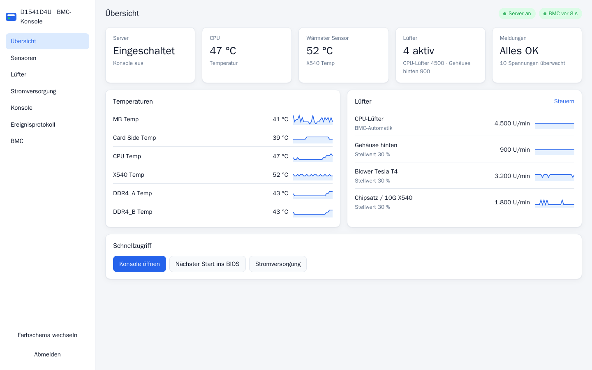
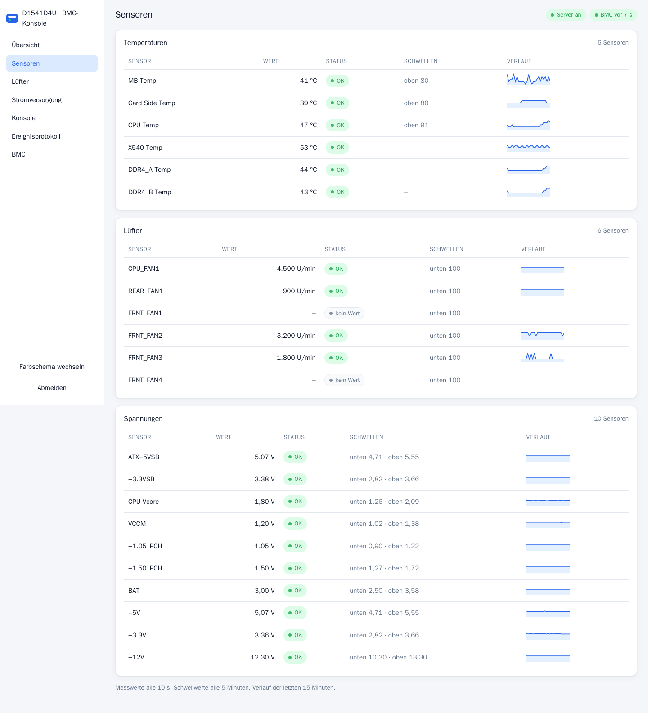
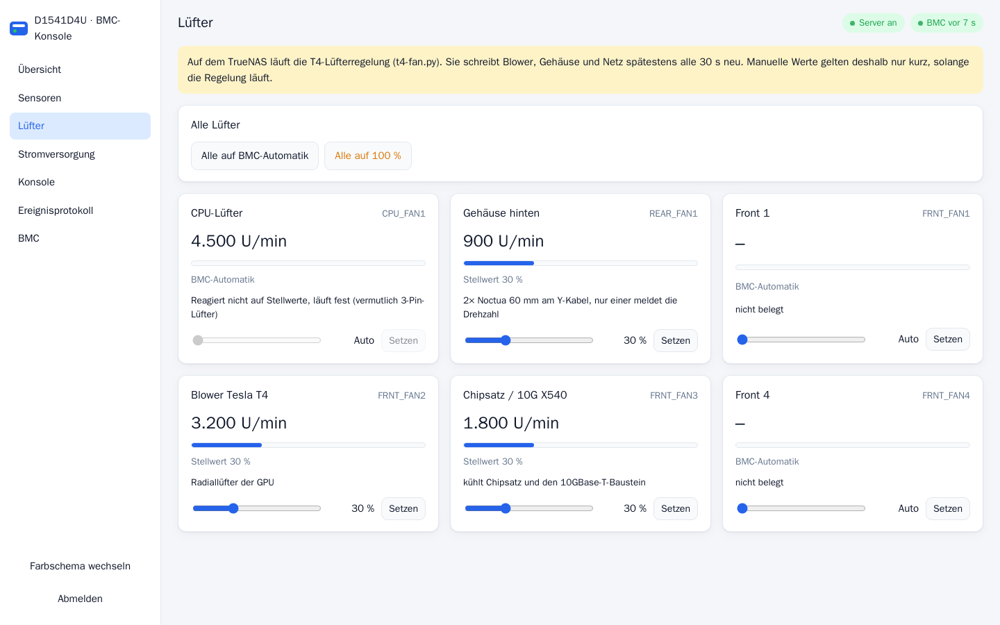
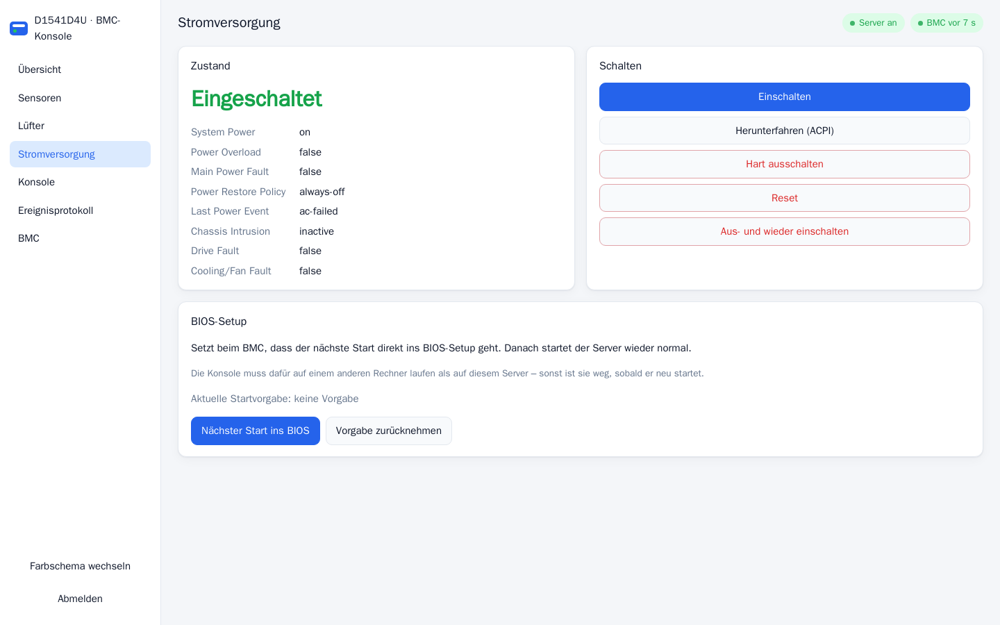
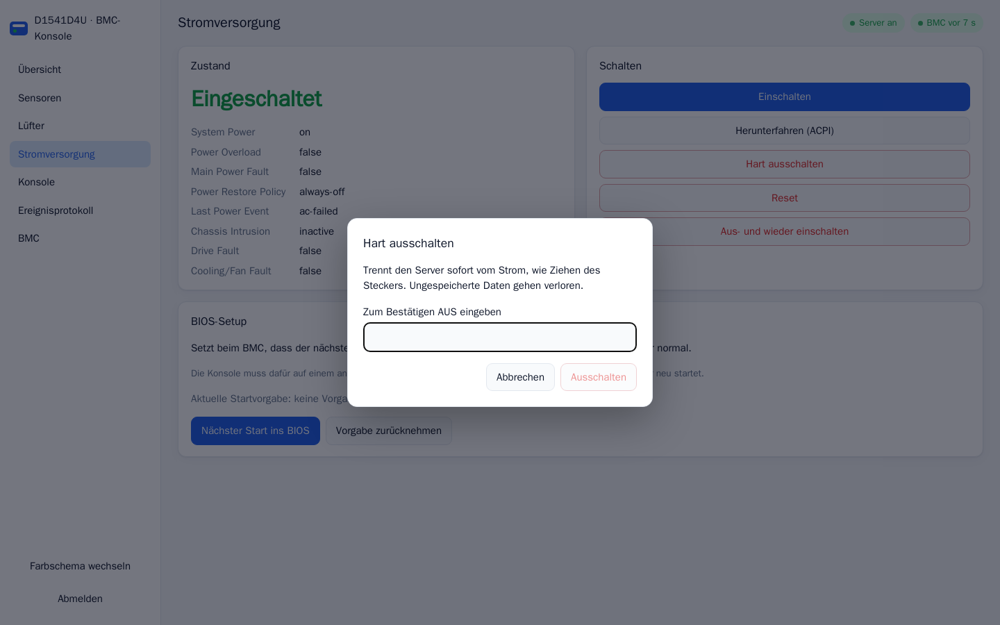
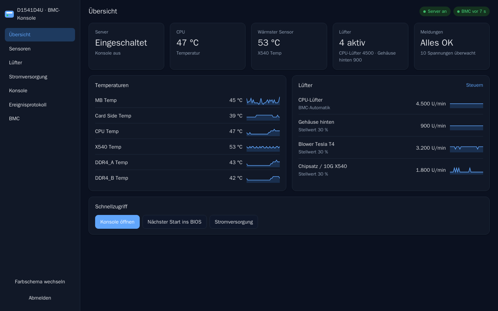
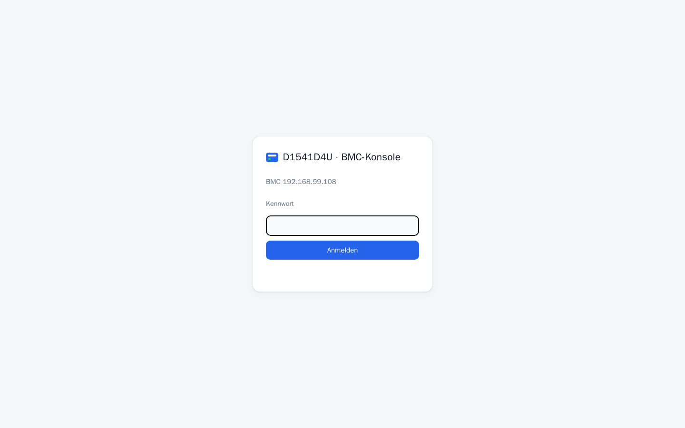
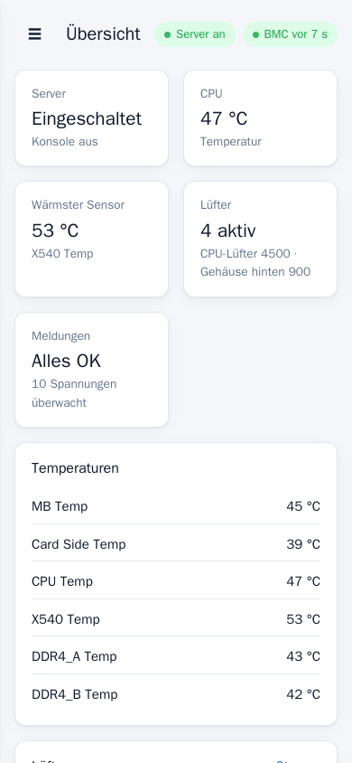

# BMC-Konsole

Weboberfläche mit HTML5-KVM für alte AMI-MegaRAC-BMCs ohne HTML5-Konsole,
gebaut und getestet am ASRock Rack D1541D4U-2T8R (BMC-Firmware 0.16, 2017).




Der BMC dieses Boards hat eine Firmware von 2017 (00.16.00, die letzte, die
ASRock veröffentlicht hat). Seine Fernkonsole läuft nur mit einem Java-Viewer,
den heutige Browser nicht mehr starten. Diese Konsole packt den Original-Viewer
in einen Container und zeigt ihn als HTML5-Seite im Browser, dazu eine moderne
Oberfläche für Sensoren, Lüfter und Stromversorgung. Am BMC selbst ändert sie
nichts.

## Bilder

| | |
|---|---|
|  **Konsole** im Browser, hier mit dem TrueNAS-Konsolenmenü |  **Sensoren** mit Schwellwerten und Verlauf |
|  **Lüfter** einzeln stellen, mit Namen statt Anschlussnummern |  **Stromversorgung** und „Nächster Start ins BIOS“ |
|  **Sicherheitsabfrage**: Ausschalten erst nach Eingabe eines Worts |  **Dunkles Farbschema** |
|  **Anmeldung**, die Konsole ist nie offen erreichbar |  **Handy-Ansicht** |

## Was sie kann

- **Konsole:** Der Original-JViewer des BMC läuft im Container unter Xvfb und
  wird über x11vnc und noVNC im Browser angezeigt. Auf dem eigenen Rechner ist
  kein Java nötig. Sondertasten (Strg+Alt+Entf, F2, Entf, F11, F12, Esc) gibt
  es als Knöpfe, außerdem einen Vollbildmodus.
- **Übersicht, Sensoren** mit Status, Schwellwerten und 15-Minuten-Verlauf
- **Lüfter** nach dem ASRock-Schema (`ipmitool raw 0x3a 0x01/0x02`), mit Namen
  aus `fans.json`
- **Stromversorgung**, dazu „Nächster Start ins BIOS“ (`chassis bootdev bios`)
- **Ereignisprotokoll**, **BMC-Informationen**, BMC-Uhr stellen, BMC neu starten

## Wie es zusammenhängt

```
Browser ──HTTPS 8443──▶ nginx ─┬─▶ Flask-App ──ipmitool lanplus──▶ BMC (623/udp)
                               │        └──HTTP-Login, JNLP──────▶ BMC (80)
                               └─▶ websockify ─▶ x11vnc ─▶ Xvfb ◀─ JViewer ──▶ BMC (80, KVM)
```

nginx ist der einzige offene Port. Für noVNC und den WebSocket fragt nginx bei
der App nach, ob die Sitzung gültig ist (`auth_request`).

Angemeldet über **HTTP** liefert dieser BMC `-kvmsecure 0 -kvmport 80`. Java
braucht dann kein TLS 1.0. Der Verkehr zwischen Container und BMC ist dadurch
unverschlüsselt, und das ist nur in einem abgetrennten Verwaltungsnetz
vertretbar.

## Starten

```bash
cp .env.example .env      # BMC_HOST und BMC_PASSWORD eintragen
docker compose up -d --build
sudo cat data/ui_password # erzeugtes Kennwort, falls UI_PASSWORD leer ist
```

Danach `https://<host>:8443` öffnen. Das Zertifikat ist selbstsigniert und
liegt unter `data/tls`. Wer ein eigenes Zertifikat hat, legt
`cert.pem` und `key.pem` dort ab.

## Wo der Container laufen sollte

**Nicht auf dem Server, dessen BMC er bedient.** Startet dieser Server neu,
etwa ins BIOS, ist die Konsole genau dann weg, wenn man sie braucht. Der
Container gehört auf einen anderen, ständig laufenden Rechner im selben Netz.

Läuft er doch einmal auf einem Host mit defekter Docker-Brücke, geht
`--network host`. Dafür sind x11vnc mit einem Zufallskennwort (bei jedem
Start neu, die Oberfläche reicht es automatisch durch) und Xvfb mit
`-nolisten local` abgesichert, damit kein anderer lokaler Prozess an Bild
oder Tastatur kommt.

## Erkenntnisse zu diesem BMC

- „Nächster Start ins BIOS“ setzt `chassis bootparam set bootflag force_bios
  options=no-timeout`. Ohne `no-timeout` verwirft dieser BMC die Vorgabe nach
  60 Sekunden (gemessen). Zurücknehmen stellt Parameter 3 wieder auf `00`.
- Die Konsole braucht den Web-Login des BMC, und der läuft über HTTP im
  Klartext. Mit `BMC_WEB_USER`/`BMC_WEB_PASSWORD` lässt sich dafür ein eigener
  BMC-Benutzer mit KVM-Recht, aber ohne Administratorrechte, verwenden.
- KVM-Token und Web-Cookie stehen in der Kommandozeile des Java-Prozesses.
  Java 8 kennt keine Argumentdateien. Auf dem Host kann sie jeder lokale Nutzer
  über `/proc` lesen.

## Hinweise

- Alle IPMI-Aufrufe laufen nacheinander. Der BMC verträgt parallele Sitzungen
  schlecht. Messwerte kommen alle 10 s über den SDR-Cache (~0,3 s), Schwellwerte
  alle 5 Minuten (~3,8 s).
- Läuft auf dem Host eine eigene Lüfterregelung, überschreibt sie manuell
  gesetzte Werte. Den Hinweis dazu steuert `FAN_NOTICE`.
- Der BMC selbst bleibt unverändert. Wird der Container entfernt, ist der
  Ausgangszustand wiederhergestellt.
